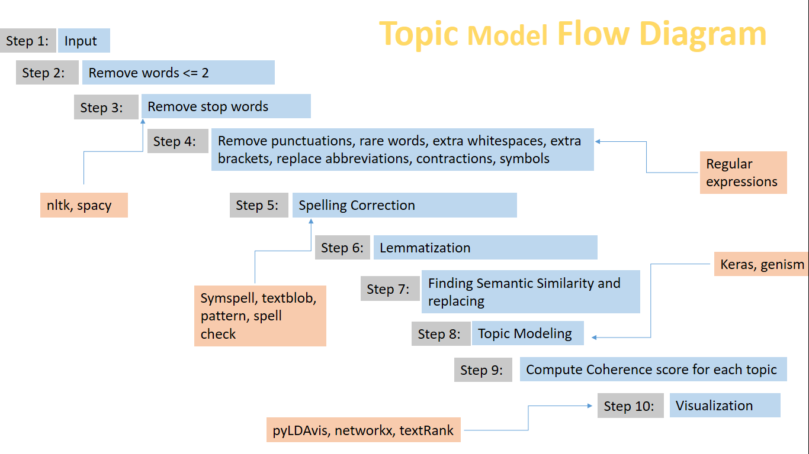

# Topic-Modeling-using-LDA

- It is also an application of NLP
- Used Latent Dirichlet Allocation algorithm for finding the topics
  - Latent: hidden
  - Dirichelt: distributio of distributions - Mapping document to topics and inturn topics to words
  - Allocation: allocating topics to each words
- Used pyLDAvis library in Python to view how well my model divided the text into topics

Flow of my work

